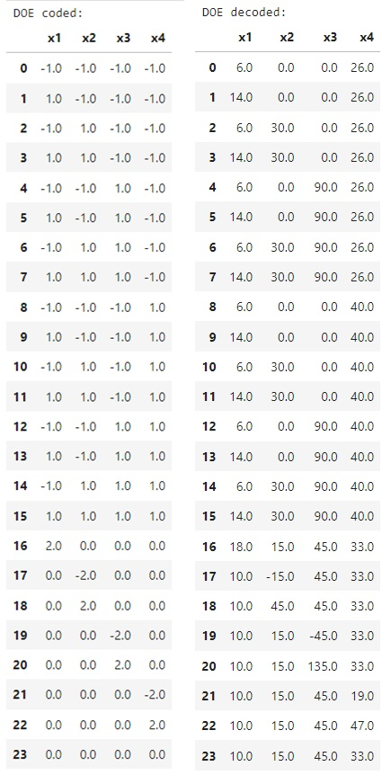
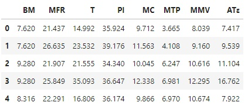
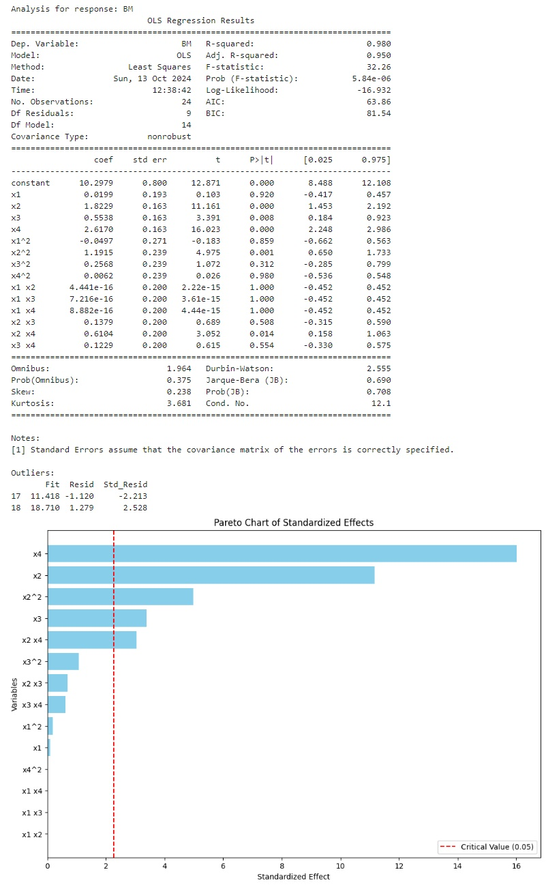
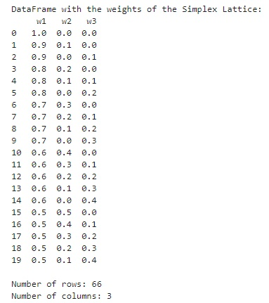
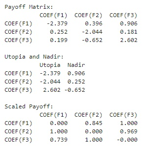
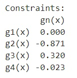
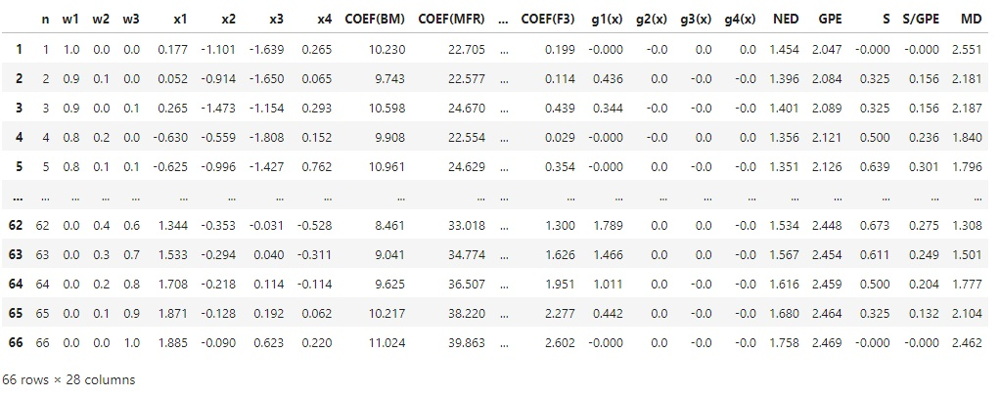

# VRF-NBI Python Code

## Description

This Python code implements the complete process for the **Varimax Rotated Factor Normal Boundary Intersection (VRF-NBI)** method, as described in the paper:
- [Nonlinear Multiobjective Optimization of Efficiency Conditions using a CFD-DOE Hybrid Approach: A Practical Application in Centrifugal Fans for Industrial Ovens](link).

The code is designed to execute all functions using Python, allowing users to work with their own dataset; however, the dataset used in the paper is also provided. This dataset was created from a Design of Experiments (DOE) using responses generated through Computational Fluid Dynamics (CFD). The extraction of latent variables was performed with Principal Components Factor Analysis (PCFA), and the multiobjective optimization was done with Normal Boundary Intersection (NBI), while the metrics for evaluating the responses used in the paper were Shannon Entropy (S) and Generalized Distance (GD). 

The main goal is to allow users to execute the VRF-NBI process in Python, across all stages of the method. The provided code does not focus on creating graphs but rather on applying the method.

## How to Use

1. Download or clone this repository to your local machine.
2. Open Jupyter Notebook.
3. Make sure the libraries are installed on your machine.
4. Use your own dataset or the one provided by the author.
5. Run the Python code blocks and obtain the results.
6. The code includes detailed comments and auxiliary figures to help you understand its functionality.

## Figures

Here are some figures related to the Jupyter Notebook used in this project.

1. **VRF-NBI CCD Design**  
     
   *Design of experiments using Central Composite Design (CCD).*

2. **VRF-NBI Responses**  
     
   *Responses obtained from the experimental design (using CFD).*

3. **VRF-NBI Correlation and Covariance**  
     
   *Correlation and covariance matrix of the original responses.*

4. **VRF-NBI PCAFA**  
     
   *Results from Principal Components Factor Analysis (PCAFA).*

5. **VRF-NBI DOE Analysis**  
     
   *Analysis of the Design of Experiments (DOE) of the original responses and the rotated factors.*

6. **VRF-NBI Coefficients**  
     
   *Coefficients obtained from the analysis.*

7. **VRF-NBI Simplex Lattice Design**  
     
   *Visual representation of the Mixture Simplex Lattice Design.*

8. **VRF-NBI Individual Optimization**  
     
   *Results of the individual optimization process of the original responses and the rotated factors.*

9. **VRF-NBI Payoff Matrix**  
     
   *Payoff matrix, Utopia, PseudoNadir, and Scaled Payoff.*

10. **VRF-NBI Additional Functions**  
      
    *Additional functions used in the NBI.*

11. **VRF-NBI Constraints**  
      
    *Constraints used in the NBI process.*

12. **VRF-NBI Results**  
      
    *Final results obtained from the VRF-NBI process with the evaluation metrics.*

## Contact

If you have any questions or suggestions, feel free to reach out via:

- **Email**: [matheusc_pereira@hotmail.com](mailto:matheusc_pereira@hotmail.com)
- **LinkedIn**: [LinkedIn Profile](https://www.linkedin.com/in/matheuscostapereira/)
- **Lattes**: [Lattes Profile](https://lattes.cnpq.br/7025666927284220)
